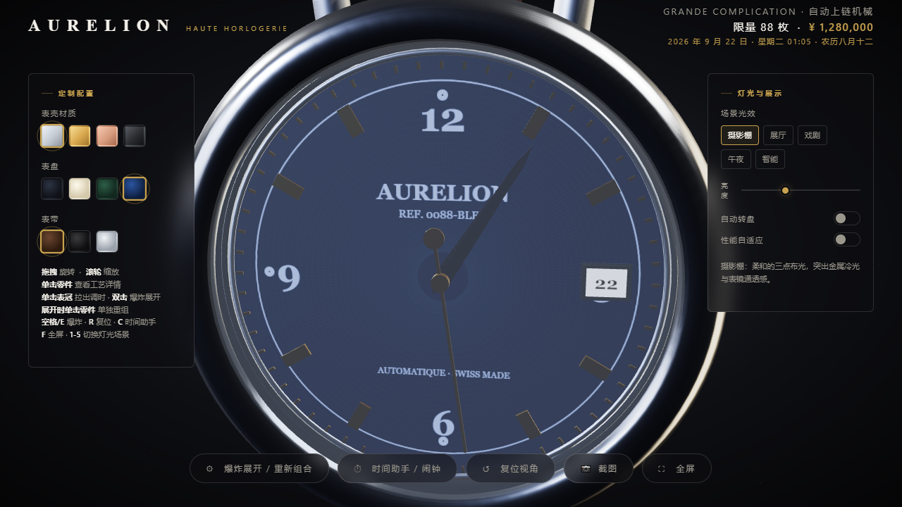

<div align="center">

# ⌚ AURELION 时光

**Haute Horlogerie on your desktop — 3D 机械腕表 + 闹钟 / 世界时钟 / 倒计时 / 定时任务的开源桌面应用**

[](https://github.com/dzhgzs/aurelion-time/releases)
[](LICENSE)

[](https://github.com/dzhgzs/aurelion-time/actions)

*程序化 3D 建模 · 离线可用 · 托盘常驻 · 无遥测无账号 · 纯原生 JS 无构建步骤*

[功能全景](#功能全景) · [系统支持](#系统支持) · [下载安装](#下载安装) · [快速上手](#快速上手) · [使用指南](#使用指南) · [功能展示](#功能展示) · [开发构建](#开发与构建) · [常见问题](#常见问题-faq)

</div>

---

## 这是什么

**AURELION 时光** 把一块可以「拆开把玩」的高级机械腕表装进你的电脑：

- **鉴赏**：three.js 程序化建模的 3D 腕表，22 组零件可爆炸展开、逐件查看工艺详情，灯光/材质/景深随时切换；
- **实用**：内建一套完整的「时间助手」——闹钟、世界时钟、倒计时、番茄专注、秒表、定时任务，支持**中文一句话智能输入**（含节日、周期表达）；
- **可靠**：托盘常驻、双写持久化、每周快照、GPU 崩溃自愈、后台不节流——到点必响；
- **干净**：离线可用、无遥测、无账号、无广告，所有数据只存在你自己的电脑上。

适合：想要一枚桌面机械表氛围的你 · 长时间使用电脑需要专注与提醒的你 · 喜欢开源与本地优先工具的你。

## 功能全景

| 模块 | 能力 |
|---|---|
| 🕰 **3D 腕表** | 22 组可交互零件爆炸展开 · 单击看工艺详情 · 5 种灯光场景 · 智能时段光效 · 表冠调时（拖动/滚轮，日历联动） · 视角截图 · 全屏 |
| 📅 **农历 · 节假日** | 自研农历引擎（1900–2100 全量含闰月）· 干支生肖 · 传统节日 + 法定假日/调休标注 · 45 天假期预告 · 2027+ 法定假日自动兜底 |
| ⏰ **闹钟** | 重复星期 · 智能相对时间（「3 小时 20 分后响」）· 15/30/60 分钟后快速一次性闹钟（定日不误响）· 渐强唤醒 + 三种合成音色 · 贪睡（重启不丢） |
| 🌍 **世界时钟** | 8 城市按本地时差排序 · 本地置顶 · 营业时段智能标注 · 快慢换算 |
| ⏳ **倒计时 · 专注** | 快捷键 + 自定义时长 · 运行中「+1 分」· 循环模式 · 番茄循环（专注/休息时长可自定义）· 今日番茄统计 · 最后 10 秒预警（夜间柔化） |
| ✍️ **智能输入** | 「明天下午3点交周报」「30分钟后开会」「1小时后」——中文时间解析 · 「中秋节上午9点订蛋糕」节日落地 · 「每天早上7点跑步」自动建重复闹钟 · 过期日期自动顺延 |
| 🔔 **响铃体验** | 金色卡片 + 时段问候 + 节日祝贺 · 渐强钟琴 · 系统通知 + 任务栏闪烁 · 键盘操作（Esc 停止 / 空格贪睡）· 错过补响 |
| 🛡 **可靠 · 安全** | 托盘常驻 · 后台不节流 · 双写持久化 + 每周快照 · GPU 崩溃自愈 · 渲染沙箱 + CSP · 无遥测 |
| ♿ **无障碍** | 全开关 aria 状态同步 · 响铃焦点直达 · 减少动态效果适配 · 刘海屏安全区 · 全控件键盘可达 |

## 系统支持

| 操作系统 | 最低版本 | 形态 | 状态 |
|---|---|---|---|
| Windows 10 | 1809 | 安装版 / 便携版 / 绿色版 | ✅ |
| Windows 11 | 全部 | 安装版 / 便携版 / 绿色版 | ✅ |
| macOS | 10.15+ | zip 通用包（Intel + Apple Silicon） | ✅ |
| 浏览器模式 | 现代 Chromium 浏览器 | 双击 `index.html` | ✅（无托盘/自启） |

> 详细的运行需求、权限、数据路径与故障排查，见 **[docs/SYSTEM-REQS.md](docs/SYSTEM-REQS.md)（操作系统与运行环境说明书）**。

## 下载安装

从 [Releases](https://github.com/dzhgzs/aurelion-time/releases) 页面下载对应产物：

| 产物 | 说明 |
|---|---|
| `AURELION时光-安装程序.exe` | **推荐**：NSIS 安装版，可选目录、自动创建快捷方式 |
| `AURELION时光-绿色版.zip` | 解压到固定目录（如 `D:\AURELION\`）即毫秒级秒开 |
| `AURELION时光-便携版.exe` | 免安装单文件，首启需解压 3~30 秒（安全软件扫描） |
| `AURELION时光-macOS.zip` | macOS 通用包，解压拖入 Applications |

源码运行 / 源码目录内置的启动方式：

| 方式 | 说明 |
|---|---|
| 桌面快捷方式「AURELION 时光」 | 日常使用推荐 |
| `启动 AURELION 时光.bat` | 首次运行自动联网准备环境 |
| 直接双击 `index.html` | 浏览器模式，功能相同（无托盘常驻） |

> 三种形态共享同一份数据目录与单实例锁，换用另一形态配置不丢、重复启动只聚焦已有窗口。

## 快速上手

1. **转一转**：鼠标拖拽旋转腕表，滚轮缩放，双击或 `E`/`空格` 爆炸展开 22 组零件，单击任意零件看工艺详情；
2. **对时**：单击**表冠**进入调时模式，拖动/滚轮校准日期时间，农历与日历窗联动；
3. **设个提醒**：右下角 `⏱` 打开时间助手 → 试试智能输入「**明天早上8点晨会**」「**每天晚上10点提醒睡觉**」「**30分钟后喝水**」；
4. **灯光氛围**：`1-5` 切换灯光场景（5 = 智能时段），`F` 全屏，`T` 置顶当挂钟；
5. **挂机**：关闭窗口 = 缩小到托盘，闹钟持续生效，托盘悬停可见「下次提醒」。

## 使用指南

### 日期 · 农历 · 节假日

- **22 组可交互零件**：爆炸展开可逐件查看——表壳/表冠/底盖/主夹板/发条盒/**发条**/二轮/三轮/擒纵轮/**擒纵叉（红宝石叉瓦）**/夹板桥/摆轮/**避震器**/表盘/**立体时标**/**刻度圈**/指针/表圈/**夜光点**/表镜/表带，单击任意零件即弹工艺详情。
- **农历显示**：顶部日期栏实时显示「农历八月十一 丙午马年」（1900-2100 年全量数据，含闰月）。
- **日期调节**：调时模式（单击表冠）下，横条显示当前指针日期与农历，并提供「‹ 前 1 天 / 后 1 天 ›」快捷换日；拖动表冠或滚轮转过午夜同样自动换日，表盘日历窗与顶部日期同步联动。
- **节假日深度标注**：法定假日显示「国庆节假期第 3 天」、调休上班日显示「春节补班」、传统节日与公历节日自动识别，清明按节气公式精确计算；抽屉显示未来 45 天假期预告。
- **2027 年起自动兜底**：放假表未收录的年份按法定基准日自动生成，界面标注「暂按法定假日，未含调休」；国务院通知公布后编辑 `js/lunar.js` 中 `VACATIONS` 表即可覆盖（内置 2025 全年官方准确、2026 公开预告）。

### 时间助手（页面右下角「⏱ 时间助手 / 闹钟」）

- **闹钟**：设置时间 + 备注 + 重复星期（默认每天）；列表显示「每天 · 3 小时 20 分后响」智能相对时间；**快速添加**：15/30/60 分钟后、明早 7:30 一次性闹钟一键创建（定日不误响）。
- **世界时钟**：八大城市按与本地时差自动排序，本地置顶；工作日 9–18 点自动标注绿色「营业中」，附「比本地快/慢 N 小时」智能换算。
- **倒计时**：1/3/5/10/25/60 分钟快捷键；自定义分钟数（1~999）；运行中可「+1 分」微调；**循环倒计时**（结束后自动重开同一时长，显示已循环轮数）；**专注循环（番茄钟）支持自定义 5~180 分钟专注 + 1~60 分钟休息，显示「今日 N 🍅」**；最后 10 秒预警；关掉应用倒计时依旧续算。
- **智能输入**：定时任务一句话添加——「明天下午3点交周报」「30分钟后开会」「1小时后」「下周三晚上8点」等中文时间自动解析；**支持节日名**：「中秋节上午9点订蛋糕」「春节前大扫除」自动落到下一个节日的公历日期；**「每天早上7点跑步」「每周三下午5点开会」自动创建重复闹钟**；已过去的日期/星期自动顺延（周X→下周、X号→下月、X月X日→明年）。
- **任务快速添加**：+30 分钟 / +1 小时 / 今晚 21:00 / 明早 8:00 一键加入；备注点击即可行内编辑；「+1时 / +1天」快捷顺延。
- **响铃键盘操作**：响铃时 `Esc`/回车 = 停止、`空格`/`S` = 贪睡；**贪睡重启不丢**，错过 5 分钟内自动补响。
- **数据备份**：抽屉底部「导出 / 导入」一键备份全部配置。
- **设置区智能收起**：整点报时/语音报时/屏幕常亮/开机自启/夜间免打扰等设置默认收起为一条手柄，鼠标悬停自动弹出、移开收起，单击可固定展开（记忆偏好）。

### 响铃表现

金色卡片（附时段问候与节日祝贺）+ 渐强唤醒钟琴 + Windows 通知 + 任务栏闪烁。
响铃自动停止（闹钟 10 分钟、其他 60 秒）；贪睡 5 分钟（可选 10/15 分钟）；睡眠唤醒错过补响。

### 智能特性

- 智能光效：按时段自动切换摄影棚/展厅/戏剧/午夜场景。
- 软件渲染自动降载：检测到无独立 GPU 的软件渲染环境时，自动关闭阴影/尘埃/毛玻璃特效，保障流畅不卡死。
- 性能自适应：默认关闭，手动开启后帧率过低时自动降渲染精度；窗口缩放不丢档位，软件渲染环境恒定锁定 1 倍缓冲。
- **闹钟可靠性**：桌面版禁用后台定时器节流——窗口最小化到托盘长时间挂机后，闹钟/倒计时/整点报时依然准时触发。
- 外观记忆、快捷键（空格/E 爆炸 · R 复位 · C 助手 · F 全屏 · T 置顶 · ? 帮助 · 1-5 灯光）、视角截图、全屏、窄屏自适应、首次引导。
- **无障碍与细节**：全部开关带 aria-checked 状态同步、toast 播报区、焦点直达响铃按钮、尊重系统「减少动态效果」偏好、刘海屏安全区适配、任务备注行内编辑。

### 数据持久化（双保险）

- 所有设置（闹钟/倒计时/外观/偏好）**双写保存**：本机存储 + 主进程配置文件镜像（`%APPDATA%\AURELION 时光\aurelion-config.json`，立即原子落盘）。
- 即使本机存储损坏或被清理，下次启动**自动从镜像恢复**；每周自动快照（保留 4 份）双重兜底。
- 抽屉「导出/导入」可额外生成 JSON 备份文件，用于手动迁移到其他电脑。

### 桌面版特性（托盘常驻）

- 关闭窗口 = 缩小到托盘，闹钟持续生效；双击托盘图标重新打开。
- 窗口大小/位置自动记忆；开机自启可开关；托盘悬停显示下次提醒。
- GPU 连续崩溃自动降级重启；页面隐藏时暂停 3D 渲染省电。

## 功能展示


*主界面：three.js 程序化 3D 建模的机械腕表，22 组零件可爆炸展开、逐件查看工艺详情。*


*农历日历：自研农历引擎（1900–2100），干支生肖、传统节日与法定假日/调休深度标注。*


*时间助手：闹钟 / 世界时钟 / 倒计时 / 番茄专注，支持中文一句话智能输入。*


*定时任务：智能解析「明天下午3点交周报」等自然语言，自动创建周期与节日提醒。*

## 开发与构建

```powershell
npm install        # 安装 Electron 33 与 electron-builder
npm start          # 启动开发版
npm run dist       # Windows：release/ 下生成 便携版.exe + 安装程序.exe
```

- 技术栈：three.js r152（程序化 3D 建模）· Electron 33 · 自研农历/节假日引擎（1900-2100）· 纯原生 JS，**无构建步骤**，改完即生效。
- 国内网络打包前先设镜像：`$env:ELECTRON_MIRROR` 与 `$env:ELECTRON_BUILDER_BINARIES_MIRROR`（npmmirror，详见 CONTRIBUTING）。
- `npm run dist` 只含 portable+nsis；**绿色版 zip 单独跑** `npx electron-builder --win zip --x64` 后改名。
- macOS 包建议在 Mac 上构建（`npm run dist:mac`）；CI 见 `.github/workflows/release.yml`（推 `v*` 标签自动构建发布）。
- 目录结构、自检命令与 PR 规范见 **[CONTRIBUTING.md](CONTRIBUTING.md)**。

## 应用内升级

应用每 24 小时读取本仓库的 **GitHub Releases**（托盘右键「检查更新」可立即检测），发现新版本弹窗跳转发布页，覆盖安装即可升级、配置数据自动保留。

## 常见问题 FAQ

<details>
<summary><b>闹钟能唤醒睡眠中的电脑吗？</b></summary>
不能，这是系统级限制。建议开启「屏幕常亮」，或在系统电源选项中允许唤醒定时器。
</details>

<details>
<summary><b>我的设置会丢失吗？会传到网上吗？</b></summary>
配置双写保存 + 每周快照 + 手动导出三重保险，全部只存本机；应用无遥测无账号，唯一网络请求是升级检查（只读）。
</details>

<details>
<summary><b>便携版为什么第一次启动慢？</b></summary>
单文件自解压 + 安全软件逐文件扫描是固有机制（3~30 秒），之后各次启动仍需解压。追求秒开请用安装版或绿色版。
</details>

<details>
<summary><b>假日安排不准怎么办（如 2027 年后）？</b></summary>
未收录年份按法定基准日自动兜底并标注「未含调休」；国务院通知公布后编辑 `js/lunar.js` 的 `VACATIONS` 表即可精确覆盖。
</details>

<details>
<summary><b>数据存在哪里？如何迁移电脑？</b></summary>
`%APPDATA%\AURELION 时光\`（macOS 为 `~/Library/Application Support/AURELION 时光/`）；抽屉「导出」生成 JSON，新电脑「导入」即可。详见 <a href="docs/SYSTEM-REQS.md">系统说明书</a>。
</details>

## 参与贡献

- Bug 与功能建议请提 [Issue](https://github.com/dzhgzs/aurelion-time/issues)（有中文表单模板）；**安全问题**请走 [SECURITY.md](SECURITY.md) 私密通道。
- 开发规范与提交流程见 [CONTRIBUTING.md](CONTRIBUTING.md)，历史变更见 [CHANGELOG.md](CHANGELOG.md)，发布流程见 [docs/PUBLISH.md](docs/PUBLISH.md)。

## License

[MIT](LICENSE) © AURELION
